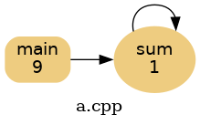
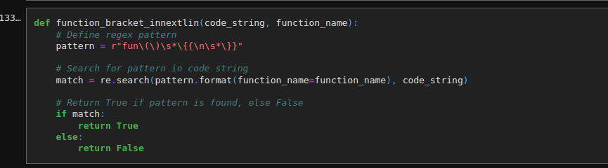
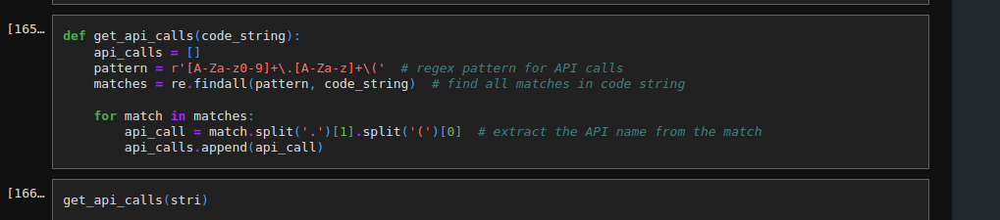
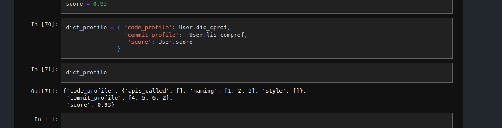
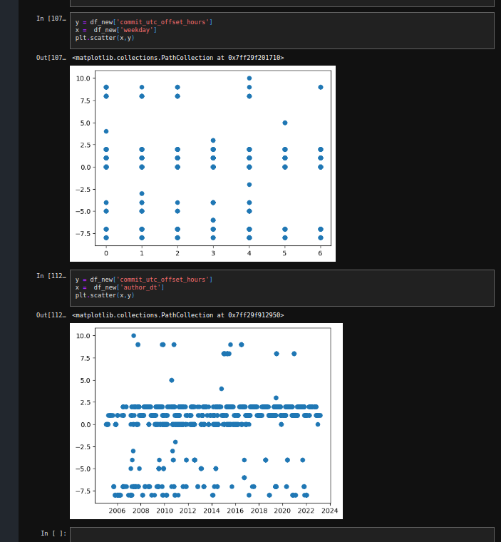
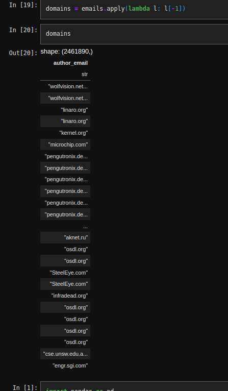

### T-HUB-hackfest-submission
code anomaly detection tool in git repos
Dependencies managed by NIX


[user-report](https://kkb-production.jupyter-proxy.kaggle.net/k/122948690/eyJhbGciOiJkaXIiLCJlbmMiOiJBMTI4Q0JDLUhTMjU2IiwidHlwIjoiSldUIn0..wdi9SGAtMwCpKvcBwikgZQ.Kit0Blxdvv6AkFBahHT9wn_IkZpOb5Vggayy6PwO_TsPYfQMZ4GCVUQc34hbYMKTj-ULIaXohA7kt6jdMn2iwWJW04J6DmvojD85TxVwdK252blkwbKUnMrGh8vXMdDJtpPiPmrG2onf6R7SREp5RpkmupbFwnlXz755HHjQTe9Y04Rb65LZoRQyxBrktn6MCaAYv6_ywYF6dN02ZPHO-g.2oOup3ToeJiGAuVZMYGj_Q/proxy/files/user_report.html)


https://www.kaggle.com/architsinghai/datasets : dataset used for eda (self made)

***Approaches:***
1) Depict dataflow in c programs and how it is transformed with new commits , example: 

```C++
 int sum(int k) {
  if (k > 0) {
    return k + sum(k - 1);
  } else {
    return 0;
  }
}

int main() {
  int result = sum(10);
  cout << result;
  return 0;
}

```

the following code churns out this graph: 
     
     
  
  
parsing patches of code and determining code profiles


   
   
parsing and collecting the apis generally used for users profile


  
  
  
profile 

 


exploratory data analysis plotting frequent pattern of commmits


   

EDA finding out domains names from email adress


   


  
  
  
  

